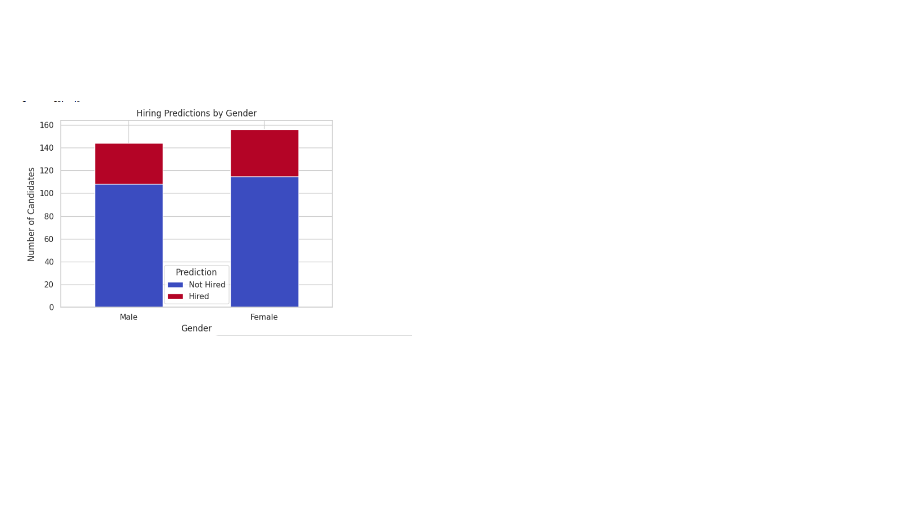

# FairHiringBias-Mitigation-NU
This project investigates bias in machine learning hiring decisions and applies fairness-aware techniques to ensure equitable treatment across gender groups. Developed for the Nile University AI Fairness Challenge, the project explores how model performance and fairness can coexist in real-world decision systems.

It aims to develop machine learning models that predict candidate hiring decisions based on multiple attributes while ensuring fairness across genders. 

## Table of Contents

- [Installation](#installation)
- [Dataset Overview](#dataset-overview)
- [Data Preprocessing](#data-preprocessing)
- [Model Architecture & Performance](#model-architecture--performance)
  - [Model Architecture](#1-model-architecture)
  - [Model Performance](#2-model-performance)
- [Fairness Analysis](#fairness-analysis)
  - [Plots](#1-plots)
  - [Metrics](#2-metrics)
- [Explainability](#explainability)
- [Bias Mitigation Techniques](#bias-mitigation-techniques)
  - [Reweighing](#1-reweighing)
  - [Feature Debiasing](#2-feature-debiasing)

## Installation

To install all the required dependencies, run:
```
pip install -r requirements.txt
```

## Dataset Overview

The dataset contains **1,500 records with 11 columns**, representing various features relevant to hiring decisions. Each row corresponds to a unique job applicant, and the goal is to **predict whether the applicant was hired based on their attributes.**

- **Observations:**
  - No missing values in any column (the dataset is clean and complete).
  - About **50.8%** male and **49.2%** female data.
  - Data has no outliers.
  - The dataset includes a sensitive attribute `Gender`, which is the focus for fairness analysis.
  - Features are already numerically encoded, making them suitable for machine learning models.


## Data Preprocessing

To ensure consistent scaling and appropriate handling of categorical variables, several preprocessing steps were applied:
  - **Min-Max Scaling:**
    - Continuous numerical features such as `Age`, `EducationLevel`, `ExperienceYears`, `PreviousCompanies`, `DistanceFromCompany`, `InterviewScore`, `SkillScore`, and `PersonalityScore` were normalized using MinMaxScaler from sklearn.preprocessing. This transformation scales all values into the range `0`, `1` improving the performance and convergence behavior of many ML algorithms.
    
The fitted scaler was also saved using `joblib` for reproducibility and potential use during inference `(minmax_scaler.pkl)`.
```
joblib.dump(scaler, 'minmax_scaler.pkl')
```

  - **One-Hot Encoding:**
    - The categorical feature `RecruitmentStrategy` was transformed into binary indicator columns using one-hot encoding via pd.get_dummies().
    - This prevents the model from assuming any ordinal relationship between different strategies, which is crucial for unbiased learning.

These preprocessing steps resulted in a fully numerical and normalized dataset, ready for training fairness-aware machine learning models.


## Model Architecture & Performance

To begin modeling, the dataset was first split into features (X) and the target variable `HiringDecision`. 
- **A stratified train-test split** was then applied to ensure that the distribution of the hiring decision labels was preserved across both training and testing sets.
- This stratification is essential when dealing with **imbalanced classes** to ensure consistent evaluation.
```
# Sample 80% of males, 20% of females
biased_train = pd.concat([
    df_male.sample(frac=0.8, random_state=42),
    df_female.sample(frac=0.2, random_state=42)
])

# Shuffle the biased training set
biased_train = biased_train.sample(frac=1.0, random_state=42).reset_index(drop=True)
```

### 1. Model Architecture

#### 1.1 Initial Model (Logistic Regression)

**Logistic Regression classifier** was trained using this biased dataset. 
  - The model was trained with a maximum of `1000 iterations` for convergence and a fixed random seed `random_state=42` for reproducibility.

#### 1.2 Best Model (Random Forest)

**Random Forest Classifier** was trained with carefully tuned hyperparameters. This ensemble learning method aggregates the predictions of multiple decision trees, which enhances model robustness and generalization.

**Model Hyperparameters:**
```
rf_clf = RandomForestClassifier(
    n_estimators=80,
    max_depth=20, 
    min_samples_split=7,
    min_samples_leaf=6, 
    max_features='sqrt',
    random_state=42
)
```
- This model achieved **the highest performance** before applying fairness mitigation techniques.

### 2. Model Performance

#### 2.1 Logistic Regression Classifier Results
- **Training Accuracy:**  `87.2%`
- **Test Accuracy:** `85.33%`

| Class / Metric   | Precision | Recall | F1-Score |
|------------------|-----------|--------|----------|
| **Class 0**      | 0.88      | 0.92   | 0.90     |
| **Class 1**      | 0.80      | 0.71   | 0.75     |
| **Macro Avg**    | 0.84      | 0.81   | 0.82     |
| **Weighted Avg** | 0.85      | 0.85   | 0.85     |
| **Accuracy**     | –         | –      | **0.85** |

#### 2.2 Random Forest Classifier Results
- **Training Accuracy:** ` 91.5%`
- **Test Accuracy:** `88.7%`

| Class / Metric   | Precision | Recall | F1-Score |
|------------------|-----------|--------|----------|
| **Class 0**      | 0.89      | 0.95   | 0.92     |
| **Class 1**      | 0.86      | 0.75   | 0.80     |
| **Macro Avg**    | 0.88      | 0.85   | 0.86     |
| **Weighted Avg** | 0.89      | 0.89   | 0.88     |
| **Accuracy**     | –         | –      | **0.8867** |


## Fairness Analysis

To assess the fairness of the model, **Demographic Parity**, **Equal Opportunity**, and **Average Odds Difference** were evaluated with respect to the `Gender` attribute.

### 1. Plots

The plot shows the distribution of hiring predictions by `gender`:
<div align="center">
  
</div>

| Gender     | Predicted Not Hired (0) | Predicted Hired (1) |
|------------|--------------------------|----------------------|
| Male (0)   | 112                      | 32                   |
| Female (1) | 107                      | 49                   |


### 2. Metrics:
- **Demographic Parity:** `-0.0919`
- **Equal Opportunity:** `-0.1802`
- **Average Odds Difference:** `-0.0855`


### Conclusion
- **Females were hired 9.2% more often than males overall.**
- Qualified females (y_true=1) had **18%** higher recall than qualified males.
- On average, **the model favors females by 8.6%.**

## Explainability

To interpret the model's hiring decisions, **SHAP (SHapley Additive exPlanations) was used with a TreeExplainer on the trained Random Forest model.** The steps:
- **Sample Selection:** `3` candidates predicted as `Hired` and `2 as `Not Hired` were selected from the **test set.**
- **SHAP Computation:** SHAP values are computed for class 1 (`Hire`) for these **5 samples.**
- **Force plots** were generated to show each feature's impact on the prediction:
  - **Red =** features pushing towards `Hire`.
  - **Blue =** features pushing towards `Not Hire`.

These plots helped confirm that `gender` had **near-zero influence**, while performance-related features (`InterviewScore`, `SkillScore`, `PersonalityScore`) were **the most influential.**

### Explanation of Sample_3:

The applicant was predicted as `Hired` with **82% confidence.**
- These features increased the hiring score significantly:
  - `Strategy_3 = 0.0`
    - Not being recruited via Strategy 3 helped the candidate. (Maybe Strategy 3 is associated with weaker applicants in training.)
  - `ExperienceYears = 0.87`(normalized)
    - This is very high experience — a strong positive factor.
  - `SkillScore = 0.83`
    - A high skill score heavily contributing to being hired.
  - `Strategy_2 = 0.0`
    - Not being recruited via Strategy 2 was a slight boost.
  - `Strategy_1 = 1.0`
    - Being recruited via Strategy 1 helped.
- These features decreased the hiring probability, but not enough to outweigh the positives:
  - `EducationLevel = 2.0`
    - Mid-level education — perhaps candidates with higher education were generally favored in training.
  - `PersonalityScore = 0.35`
    - Below-average — had some negative influence.
   
### Feature Importance

To show which features contribute most on average to predictions for class 1 (`Hire`) across the selected 100 samples (sample_X), a **global feature importance bar plot** was generated using **SHAP values for class 1 (`Hire`).** 
```
shap.summary_plot(shap_values_class1, sample_X, plot_type="bar")
```

### Conclusion

- `Gender` has almost **zero SHAP importance** which means the model isn’t directly using the Gender feature to make hiring decisions.
  
Earlier we found that:
- **Demographic Parity:** `~9.2%` more likely to hire females.
- **Equal Opportunity:** `~18%` more likely to correctly hire qualified females.
  
This suggests:
- Indirect bias is present.
- `Gender` may be correlated with other features (like lower scores or different strategy distributions).

- **Indirect Bias Flow:**
`Gender` → `Strategy` → `Score Distributions` → **Prediction.**

**SHAP results align well with correlation matrix, and both validate each other.**


## Bias Mitigation Techniques

To address gender-related bias in hiring decisions, multiple bias mitigation techniques were explored and evaluated their effects on model fairness and performance.

### 1. Reweighing

The Reweighing technique from the AIF360 library was applied to adjust instance weights in the training dataset based on group membership `Gender` and label `HiringDecision`. This method aims to reduce bias by assigning different weights to privileged (Male) and unprivileged (Female) groups to ensure fairness during training.

```
rw = Reweighing(
    privileged_groups=privileged_groups,
    unprivileged_groups=unprivileged_groups
)
train_rw = rw.fit_transform(train_bld)
```
- The Random Forest Classifier (best-performing model) was trained with the **same hyperparameters** as before on the reweighted dataset and evaluated its fairness.

**However, the fairness metrics worsened slightly after reweighing compared to the original biased dataset.**

### 2. Feature Debiasing

To improve fairness, Feature Debiasing approach was adopted manually by removing or minimizing the influence of the Gender feature.

- The Random Forest Classifier was trained again using the same parameters after applying this mitigation strategy.

#### Fairness Metrics After Feature Debiasing:

| **Metric**                     | **Value**   |
|-------------------------------|-------------|
| Demographic Parity (FD)       | -0.0849     |
| Equal Opportunity (FD)        | -0.2052     |
| Average Odds Difference (FD)  | -0.0884     |


#### Bias Mitigation Comparison

| **Metric**                    | **Before Mitigation** | **After Reweighing** | **After Feature Debiasing** |
|------------------------------|------------------------|-----------------------|------------------------------|
| **Test Accuracy**            | 0.8867                 | 0.8833                | 0.8767                       |
| **Demographic Parity**       | -0.0919                | -0.0983               | -0.0849                      |
| **Equal Opportunity**        | -0.1802                | -0.1802               | -0.2052                      |
| **Average Odds Difference**  | -0.0855                | -0.0904               | -0.0884                      |


#### Final Conclusion

- Equal Opportunity worsened after feature debiasing.
  
Despite removing `Gender`, the model still exhibits **indirect bias (possibly due to proxy variables that correlate with gender (`strategy`, `personality_score`, `interview_score`)).**


